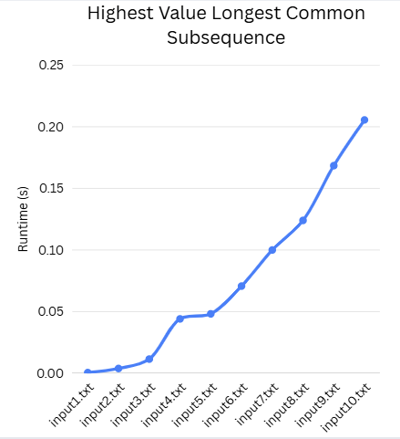

# COP 4533 – Programming Assignment 3 (PA3)

## Team Members
- Priyanka Jain (UFID: 31478022)
- Alicia Ellis (UFID: 79954495)

## Language Used
Python 3, no compilation required

## How to Run the Program
Make sure you are in the root directory of the project.

The available input files are located in the "test" directory;
    1. input1.txt
    2. input2.txt
    3. input3.txt
    4. input4.txt
    5. input5.txt
    6. input6.txt
    7. input7.txt
    8. input8.txt
    9. input9.txt
    10. input10.txt

When a command is executed, the results for the maximum value common subsequence will print to the terminal.

The output format is below:
    integer -> the maximum value of the common subsequence
    string -> the optimal common subsequence
    If using -t flag:
    Runtime: integer + s -> how long the algorithm took to run.


### Basic Run Command:
```bash
python src/main.py <input_file>
Example: python src/main.py -f test/input1.txt or python src/main.py -t -f test/input1.txt
```

## Assumptions:
K is accurate.
Characters A and B are in the alphabet.
Values are nonnegative integers.
Strings are on a single line.
No empty lines mid-input.
Input has at least K+3 non-blank lines.

## Written Portion
### Q1: Runtime of 10 files

Question 1 is also in the "PA3 Written Portion.pdf" document
### Q2 & Q3: 
Questions from written portion is in the "PA3 Written Portion.pdf" document
